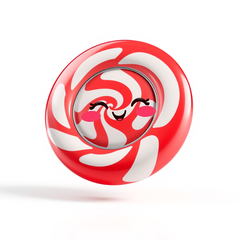
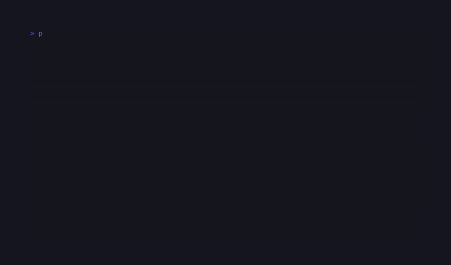

# CandyFlip

<!-- BADGES:BEGIN -->
[](https://github.com/detain/sugarcraft/actions/workflows/ci.yml)
[](https://app.codecov.io/gh/detain/sugarcraft?flags%5B0%5D=candy-flip)
[](https://packagist.org/packages/sugarcraft/candy-flip)
[](LICENSE)
[](https://www.php.net/)
<!-- BADGES:END -->




ASCII GIF viewer on the SugarCraft stack — port of [`namzug16/gifterm`](https://github.com/namzug16/gifterm). Decodes a `.gif` on disk via `ext-gd`, downsamples each frame to a configurable cell grid, and renders the animation into the terminal as ANSI-coloured Unicode block-glyphs at a configurable framerate.

```bash
composer require sugarcraft/candy-flip
candy-flip my-animation.gif         # solid-block preset (default)
candy-flip my-animation.gif density # ASCII luminance ramp
```

## Keys

| Key                | Action                              |
|--------------------|-------------------------------------|
| `Space`            | Pause / resume                      |
| `←`                | Step back one frame                 |
| `→`                | Step forward one frame              |
| `d`                | Toggle solid ↔ density preset       |
| `q` / `Esc`        | Quit                                |

## Architecture

| File         | Role                                                                              |
|--------------|-----------------------------------------------------------------------------------|
| `Decoder`    | Reads the GIF, locates per-frame image-descriptor offsets, hands each frame to GD, downsamples to a cell grid, returns a list of {@see Frame}. |
| `Frame`      | Pure value — 2-D RGB grid in cell coordinates.                                    |
| `Renderer`   | ANSI emitter. Two presets: `solid` (24-bit `█` blocks) or `density` (luminance ramp). |
| `Player`     | SugarCraft Model — index + paused + preset state. `Cmd::tick(...)` schedules frame advance. |
| `TickMsg`    | Frame-tick message produced by the Cmd.                                           |

The decoder caps at 256 frames so a runaway file can't OOM the runtime; pause + manual step are always available even on long animations.

## Test

```bash
composer install
vendor/bin/phpunit
```
