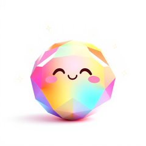
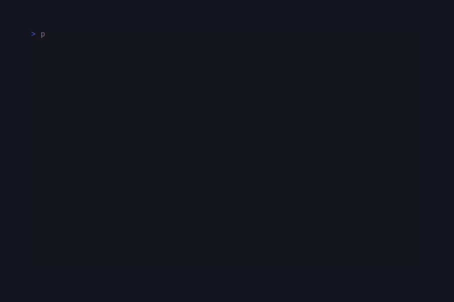

# CandyShine

<!-- BADGES:BEGIN -->
[](https://github.com/detain/sugarcraft/actions/workflows/ci.yml)
[](https://app.codecov.io/gh/detain/sugarcraft?flags%5B0%5D=candy-shine)
[](https://packagist.org/packages/sugarcraft/candy-shine)
[](LICENSE)
[](https://www.php.net/)
<!-- BADGES:END -->




PHP port of [charmbracelet/glamour](https://github.com/charmbracelet/glamour) —
Markdown → ANSI renderer built on `league/commonmark` and CandySprinkles.

```sh
composer require sugarcraft/candy-shine
```

## Quickstart

```php
use SugarCraft\Shine\Renderer;

echo (new Renderer())->render(<<<MD
# Welcome

A few **bold** and _italic_ words, with `inline code` and a
[link](https://example.com).

- one
- two
- three

```php
echo "hello world";
```
MD);
```

## Themes

Stock presets:

```php
use SugarCraft\Shine\{Renderer, Theme};

new Renderer(Theme::ansi());        // default colourful
new Renderer(Theme::plain());       // no SGR
new Renderer(Theme::notty());       // alias for plain — non-TTY fallback
new Renderer(Theme::dark());        // dark-bg optimised
new Renderer(Theme::light());       // light-bg optimised
new Renderer(Theme::dracula());     // #282a36 / #ff79c6 palette
new Renderer(Theme::tokyoNight());  // #1a1b26 / #7aa2f7
new Renderer(Theme::pink());        // playful sweet palette
```

Custom JSON theme:

```php
$theme = Theme::fromJson('./themes/my-theme.json');
echo (new Renderer($theme))->render($markdown);
```

JSON shape: an object keyed by element name (`heading1`, `paragraph`,
`bold`, `italic`, `code`, `codeBlock`, `link`, `blockquote`,
`listMarker`, `rule`, `keyword`, `string`, `number`, `comment`,
`strike`, `linkText`, `image`, `htmlBlock`, `htmlSpan`,
`definitionTerm`, `definitionDescription`, `text`, `autolink`); each
value carries `foreground` / `background` (hex / `ansi:N` /
`ansi256:N`) plus the SGR flags (`bold`, `italic`, `underline`,
`strike`, `faint`, `blink`, `reverse`).

## Word-wrap + OSC 8 hyperlinks

```php
$renderer = (new Renderer(Theme::dark()))
    ->withWordWrap(80)
    ->withHyperlinks(true);

echo $renderer->render($markdown);
```

`withHyperlinks(true)` (default) wraps every `[text](url)` in
`OSC 8 ; ; URL ST text OSC 8 ; ; ST` so terminals that support it
render real clickable links. Falls back to `text (url)` when off.

## What it renders

- Headings 1-6, paragraphs, `**bold**`, `_italic_`, `~~strike~~`.
- Inline code, fenced code blocks (with regex syntax highlighting for
  PHP / JS / TS / JSON / Python / Go / Bash / SQL), indented code.
- Bullet + ordered + nested lists.
- Block quotes (▎-prefixed).
- GFM tables (rendered via `Sprinkles\Table` with rounded border).
- Task lists (`☑` / `☐`).
- Links (with OSC 8 hyperlinks), autolinks, images (alt + url).
- HTML blocks + inline HTML — pass through with theme styling.
- Thematic breaks.

## Authoring a custom theme

A `Theme` is a value object — every slot is a `Style` (or scalar).
Build one with the constructor and feed it to `new Renderer($theme)`:

```php
use SugarCraft\Core\Util\Color;
use SugarCraft\Shine\Theme;
use SugarCraft\Sprinkles\Style;

$theme = new Theme(
    heading1:  Style::new()->bold()->underline()->foreground(Color::hex('#ff5f87')),
    heading2:  Style::new()->bold()->foreground(Color::hex('#ffd700')),
    heading3:  Style::new()->bold()->foreground(Color::ansi(14)),
    heading4:  Style::new()->bold()->foreground(Color::ansi(12)),
    heading5:  Style::new()->bold()->foreground(Color::ansi(13)),
    heading6:  Style::new()->bold()->foreground(Color::ansi(10)),
    paragraph: Style::new(),
    bold:      Style::new()->bold(),
    italic:    Style::new()->italic(),
    code:      Style::new()->foreground(Color::hex('#ffd700')),
    codeBlock: Style::new()->faint(),
    link:      Style::new()->underline()->foreground(Color::ansi(12)),
    blockquote: Style::new()->italic()->foreground(Color::ansi(8)),
    listMarker: Style::new()->foreground(Color::hex('#ff5f87')),
    rule:      Style::new()->foreground(Color::ansi(8)),

    // Element extensions:
    headingPrefix:    '❯ ',
    headingCase:      'upper',
    paragraphPrefix:  '  ',
    documentMargin:   1,
    listLevelIndent:  4,
    taskTickedGlyph:  '✓',
    taskUntickedGlyph:'·',
    horizontalRuleGlyph: '═',
    horizontalRuleLength: 60,
);

echo (new Renderer($theme))->render($markdown);
```

The full slot reference (left-to-right reading the constructor):

| Block | Slots |
|---|---|
| Headings | `heading1` … `heading6` (with `headingPrefix`, `headingSuffix`, `headingCase`) |
| Paragraphs | `paragraph` (+ `paragraphPrefix` / `paragraphSuffix`) |
| Inline | `bold` · `italic` · `strike` · `code` · `link` · `linkText` · `autolink` · `image` · `imageText` · `text` |
| Block | `codeBlock` · `blockquote` · `rule` · `listMarker` · `htmlBlock` · `htmlSpan` |
| Document | `documentMargin` · `documentIndent` · `documentBlockPrefix` / `Suffix` |
| Lists | `orderedListMarker` · `unorderedListMarker` · `orderedListMarkerFormat` · `unorderedListMarkerGlyph` · `listLevelIndent` |
| Task list | `taskTickedGlyph` · `taskUntickedGlyph` |
| Horizontal rule | `horizontalRuleGlyph` · `horizontalRuleLength` |
| Tables | `tableHeader` · `tableCell` · `tableSeparator` · `tableCenterSeparator` · `tableColumnSeparator` · `tableRowSeparator` |
| Definition lists | `definitionTerm` · `definitionDescription` · `definitionList` |
| Syntax highlighting | `keyword` · `string` · `number` · `comment` |

Stock themes (`Theme::ansi()`, `Theme::dark()`, `Theme::dracula()`,
`Theme::tokyoNight()`, `Theme::pink()`, `Theme::light()`, `Theme::ascii()`,
`Theme::notty()`, `Theme::plain()`) are good starting points — copy
the constructor call and adjust the slots you care about.

`Theme::fromEnvironment(?$default)` reads `GLAMOUR_STYLE` (case-
insensitive, hyphen / underscore tolerant) so users can override the
theme without code changes:

```sh
GLAMOUR_STYLE=tokyo-night php examples/render.php
```

## Renderer options

```php
new Renderer($theme)
    ->withWordWrap(80)               // wrap paragraphs / blockquotes / lists
    ->withHyperlinks(true)           // emit OSC 8 link envelopes
    ->withBaseURL('https://docs.example.com/')  // prefix relative links
    ->withTableWrap(true)            // wrap text inside table cells
    ->withInlineTableLinks(false)    // suppress (url) suffix in cells
    ->withPreservedNewLines(true)    // keep `\n\n+` runs from source
    ->withStandardStyle('dracula')   // re-pick the stock theme
    ->withEmoji(true);               // expand `:smile:` shortcodes
```

`Renderer::renderMarkdown($md, ?Theme)` is a one-shot static
convenience for ad-hoc rendering. For repeated renders with the same
theme, build a Renderer and reuse it (the parser is cached per
instance).

## Test

```sh
cd candy-shine && composer install && vendor/bin/phpunit
```

## Demos

### Render


### Themes


