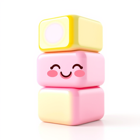
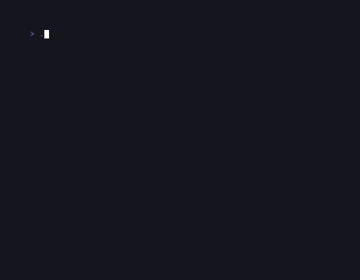

# CandyTetris

<!-- BADGES:BEGIN -->
[](https://github.com/detain/sugarcraft/actions/workflows/ci.yml)
[](https://app.codecov.io/gh/detain/sugarcraft?flags%5B0%5D=candy-tetris)
[](https://packagist.org/packages/sugarcraft/candy-tetris)
[](LICENSE)
[](https://www.php.net/)
<!-- BADGES:END -->




Tetris built on the SugarCraft stack. SugarCraft runtime, CandySprinkles for the rounded borders and per-piece colours, deterministic 7-bag RNG, ghost piece, hard drop, hold, level-driven gravity ramp, line-clear scoring.

## Run it

```bash
composer install
./bin/tetris
```

## Controls

| Key       | Action            |
|-----------|-------------------|
| ← / →     | Move left / right |
| ↑ / x     | Rotate clockwise  |
| z         | Rotate counter-cw |
| ↓         | Soft drop         |
| Space     | Hard drop         |
| p         | Pause / resume    |
| q         | Quit              |

## Scoring (NES-classic)

| Lines cleared | Base points × (level + 1) |
|---------------|----------------------------|
| 1             | 40                         |
| 2             | 100                        |
| 3             | 300                        |
| 4 (Tetris)    | 1200                       |

Level rises every 10 lines. Gravity speeds up at every level — by level 9 pieces fall every 6 frames, by level 29+ they fall every frame. The frame-rate-agnostic `Score::framesPerRow()` is what the gravity tick consults.

## Architecture

Six pure-state classes, each individually testable without booting the runtime:

```
Tetromino  enum  ─►  shape data + colour for each of the 7 pieces
Piece      VO    ─►  Tetromino + rotation + (x, y), with immutable transforms
Board      VO    ─►  10×24 grid (4 hidden rows above), fits/place/clearLines/dropPiece
Bag        ──►  7-bag RNG with peek(); injectable RNG closure for deterministic tests
Score      VO    ─►  points / lines / level + level-driven gravity interval
Game       Model ─►  SugarCraft Model orchestrating the above + key handling

Renderer   ──►  pure view function from Game to frame string
```

Why so split? Because each piece is testable in isolation — line-clear correctness has nothing to do with rotation correctness has nothing to do with score arithmetic. The full test suite is **41 tests, 1535 assertions** and runs in 30 ms; the deterministic RNG injection means even the `Game` integration tests are reproducible across runs.

## Status

Phase 9+ entry #19 — first cut. All standard SRS rules, ghost piece, level/gravity, scoring. Wall-kicks are a tiny ±2 horizontal nudge rather than full SRS-spec; OK for v0.
